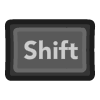

# web-tetris

<h1 align="center">Tetris</h1>

  

    Tetris game made with JavaScript, HTML and CSS.

[Live demo](https://leandrosq.github.io/web-tetris/)

## How to play

### Keyboard

| Key | Icon| Description |
| -- | -- | -- |
| <kbd>Arrow up</kbd> |  | Rotate Clock-wise |
| <kbd>Arrow left</kbd> |  | Move left, if oneshot instantly moves. Allowing for hypertapping |
| <kbd>Arrow right</kbd> |  | Move right, if oneshot instantly moves. Allowing for hypertapping |
| <kbd>Arrow down</kbd> |  | Accelerates vertical fall |
| <kbd>Enter</kbd> |  | Rotate Anti-Cock-wise |
| <kbd>Space</kbd> |  | Hard drop |
| <kbd>Esc</kbd> |  | Pause game |
| <kbd>Shift</kbd> |  | Faster horizontal movement when pressed alongside <kbd>Arrow Left</kbd> or <kbd>Arrow Right</kbd> |
| <kbd>M</kbd> | | Hold current piece |

### Game pad

<small>The game supports any GamePad, being Wireless, wired, Xbox, Generic or PS-X.</small>

| Button | Icon | Description |
| -- | -- | -- |
| <kbd>A</kbd> |  | Rotate Clock-wise |
| <kbd>X</kbd> |  | Rotate Anti-Cock-wise |
| <kbd>B</kbd> |  | Hard drop |
| <kbd>Y</kbd> |  | Hold current piece |
| <kbd>Left Pad</kbd> |  | Move left, if oneshot instantly moves. Allowing for hypertapping |
| <kbd>Right Pad</kbd> |  | Move right, if oneshot instantly moves. Allowing for hypertapping |
| <kbd>Down Pad</kbd> |  | Accelerates vertical fall |
| <kbd>Menu</kbd> |  | Pause game |
| <kbd>LT or RT</kbd> |   | Faster horizontal movement when pressed alongside <kbd>Left Pad</kbd> or <kbd>Right Pad</kbd> |

---

## Features

- GamePad API
- WebAudio API
  - Pitch manipulation
  - Looping sounds
  - Audio decoding from array buffer
- Localization
  - Available in:
    - Português - Brasil
	- English
- Fetch API
- Double buffering canvas
- HighDPI (Retina compatible) canvas
- Modern JavaScript (ES2021)
  - Modules
  - Classes
  - Private fields
- Follows Official Tetris Guidelines
- Animations
- Particle system
- Level system
- State machine
- Start menu, Pause and Game over screens

## Levels

In my version of tetris, not only colors and speed are modified when a new level is reached, the shape of the board is also affected. This introduces a new dimension where not only you need muscle memory, speed and dexterity to play, but you will also need to adapt and pay attention visually to these changes.
This in my opinion turns the game much more fun for those, like myself, that aren't Tetris masters and cannot go in impossible speeds, this adds the adaptability challenge by inviting your vision and brain to change.

### Level 1
	- Flat colors
	- Squircle

### Level 2
	- Flat colors
	- Square

### Level 3
	- Dracula colors
	- Squircle outline

### Level 4
	- Monokai colors
	- Circle
	
### Level 5
	- Material colors
	- Hexagon

## Changelog

### v2.0.0

- Complete overhaul and refactor of the game
- Added UI elements inside the canvas
- Better fixed game loop
- Added hard drop system
- Added holding piece system
- Added peeking the Random bag
- Better visuals
- Added better responsiveness, for future mobile support
- Added support for the GamePad API
- Added Localization
- Added shape shifting logic for each level

  

### v1.0.0

  

## TODO

[] - Add more levels

[] - Mobile support

[] - Settings menu

[] - In-game controls information

## Acknowledgements

[ThoseAwesomeGuys Prompts](https://thoseawesomeguys.com/prompts) for the Keyboard and GamePad icons.

[Zeh Jose Fernando Baldo Carneiro](https://www.dafont.com/nokia-cellphone.font) for the Font (NokiaFC22) used on this game.
